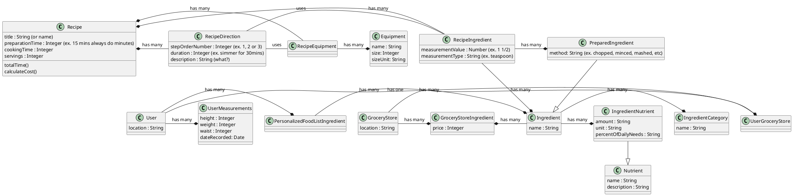

## IDEAS
- What's important is to eat the **same core ingredients** (lose or maintain weight and stay healthy)
- Change the flavour, taste and texture up with **different preparation and cooking methods**

## Overview

Recipes become much more interesting when you understand what nutritional value the meal contains

ESHA Research Database: Nutrition Database API
https://rapidapi.com/collection/nutrition (free apis)
https://developer.edamam.com/edamam-nutrition-api
https://spoonacular.com/food-api/pricing

Most recipe sites just give you the recipe and some nutrition "facts" which leaves a lot of the work to be done by the user to figure out what or how much they should eat

ex. What should I be eating, how much, how often, if my goals are X?

Where can I get these ingredients?

What can or should I substitute? And with what?
https://www.allrecipes.com/article/common-ingredient-substitutions/

I only want to see the recipes that I can actually do at home (the method of preparation, or cooking)

What does a certain method of cooking do to the ingredients? (i.e. pan frying vs deep 
frying, etc)

What about brands to avoid completely?

What about cost of ingredients?

## Goal
Reduce time needed to learn to cook healthy meals

## Plan
- Retrieve nutrition info per ingredient via third-party APIs
- Identify user's GOAL
- Based on user's goal help determine 
	- **What** a user should eat (see personalized food list)
	- **How much** a user should eat (hand measurements, depends on goals)
	- **How often** a user should eat (depends on goals)
	- **Where** can a user get ingredients (local grocery stores)
- If they don't have it, or can't find it, **what can they substitute**?
- What does a recipe **cost**?
- Blacklist brands (let user define)

---

## Inputs
Body weight
Height
Waist measurement (belly? does it matter?)
Thigh measurement?

How much extra fat do I have?
Do I need more fat?

What about health conditions?

---

## Recipe
- Ingredients
- Directions
- Per serving (well how much should I specifically be eating?)

---

## Meal Planning
- How much to eat of what?
- What about fasting?

Serving size is complicated because there's a difference between servings in what you cooked vs what you should eat

